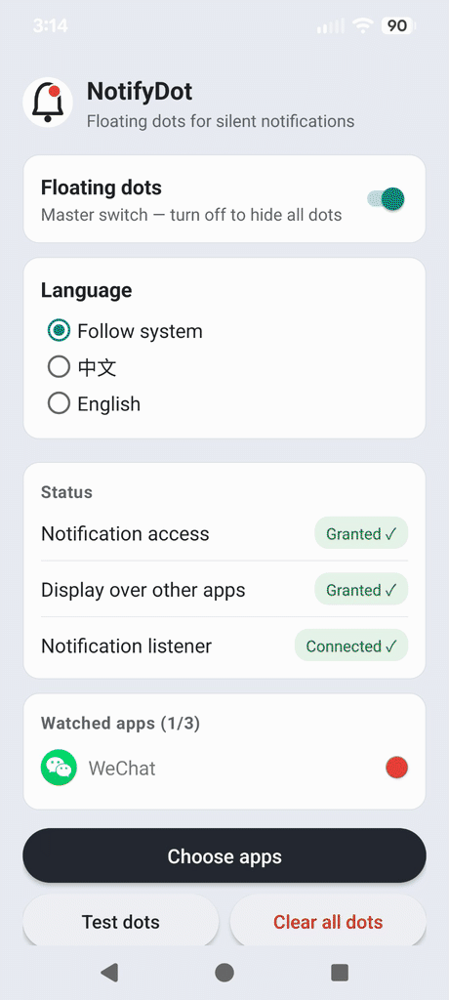

# NotifyDot

**Never miss what matters. Without being interrupted.**

NotifyDot puts a small red dot on your screen when selected apps have unread
notifications. The dot stays visible over other apps until you check them.
No sound. No vibration. No banners.

NotifyDot never reads, stores, or transmits notification contents. It only
detects whether a selected app has a pending notification.

## How it works

1. Choose the apps you don't want to miss.
2. Grant Notification Access and overlay permission.
3. A red dot appears whenever one of those apps has a pending notification.

Open the app → the notification is considered checked → the dot disappears.

## Why

Have you ever silenced WeChat to survive a workday, then missed an important
message because Android hid the silent icon and you never pulled down the
shade?

Have you ever turned the icon back on, only to have it squeezed out by a
crowded status bar or disappear inside a full-screen app?

Have you ever turned the sound on instead, then winced as it rang through
a meeting — or walked back to your phone and realized the moment had passed?

NotifyDot is a small red dot that stays on top of everything — your home
screen, Chrome, other apps — until you check. No sound. No vibration.
No banners. Just a persistent, impossible-to-miss "hey, something's waiting"
for the few apps you never want to miss.

### Why not just use notification badges?

Badges live on your launcher icons — invisible while you're inside another
app. Worse, many launchers only offer a global badge switch: all apps or
none, no way to enable badges for just the one or two apps you care about.
NotifyDot lets you pick exactly those apps, and the dot floats on top of
whatever you're doing.

## Status: early beta

This app is currently distributed outside Google Play as an early beta.
It is free, has no ads, no account, and no analytics.

## Permissions — and why each one is needed

- **Notification access** — to detect pending notifications from the apps you
  select. Notification *contents* (title, text, sender) are never read,
  stored, or transmitted anywhere. Only "this app has something unchecked"
  is used.
- On newer Android versions, the notification access page for NotifyDot may
  show four toggles (Real-time, Conversations, Notifications, Silent).
  NotifyDot watches all notification types from your selected apps — keep
  the defaults (all on) so nothing slips through. Turning one off means
  you'll miss that kind of notification.
- **Display over other apps** — to draw the red dot on top of other apps.
- **Ignore battery optimizations** — so the dot keeps working reliably in
  the background.

## Install

Download the APK from
[Releases](../../releases),
install it, and complete the 3-step setup inside the app. All three grants
are required.

## Compatibility

Android 10 and above. Tested on Pixel 8 Pro (Android 17) and Galaxy S24 FE
(One UI 8.5, Android 16).

## Privacy

NotifyDot works fully offline. It does not collect, upload, or share any
data. Your notification contents never leave your phone — the app never
even reads them.

## Feedback

Found a bug or have a feature request? Open an
[issue](../../issues) — screenshots and your phone model / Android version
help a lot.

## License

© 2026 Real Good Design. All rights reserved. The APK is provided for personal
use; redistribution or reverse engineering is not permitted.
